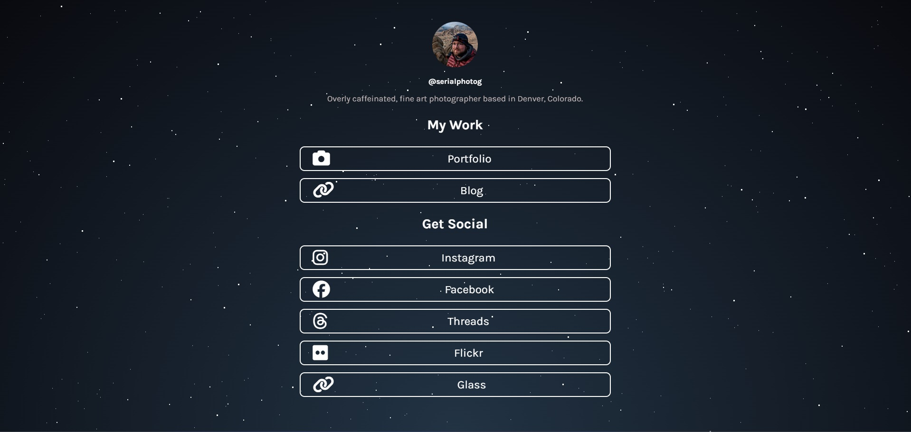

# LinkTree-Like Bio Links
#### A simple site to group all of my profiles in one place.



## 💡 About

We're probably all familiar with services like `LinkTree` or `bio.site`. These are all fine services, but I wanted a super simple, self-hosted solution. This is my free, open-source alternative to these hosted solutions. 

- [Demo](https://thisisadamthompson.com)

## 🚀 Getting Started

Getting started using this for your self is simple. First, clone the project:

```bash
git clone https://github.com/serialphotog/bio-links.git
```

Next, make your own edits to the site and deploy it. That's it!

**Note:** For those that are curios, I am hosting my instance of this project using Cloudflare Pages. I would personally recommend that you simply fork this project, clone it, make your edits, and then set up Cloudflare Pages to auto-deploy your site from your forked Git repo.

## 📝 License

This project is licensed under the MIT License. See the [LICENSE](LICENSE.md) file for more details.